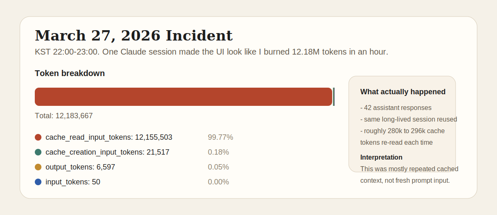

# claude-code-cache-read-circuit-breaker

폭주하는 `cache_read_input_tokens`를 막는 Claude Code 플러그인입니다.

[English](./README.md)

번역기를 사용합니다.

이전에는 이런 걸 겪어본 적이 없어서 별일 아니라고 생각했는데,
직접 맞아보니까 아니었습니다.

저기 보이는 1200만 토큰,
18분 만에 나간 겁니다.

에이전트를 돌릴 때 맞았습니다.
재귀적인 현상 같긴 한데, 이건 좀 심하다고 느꼈습니다.

그래서 단순한 hook를 만들었습니다.
사용량 제한을 걸고,
숫자는 취향대로 바꾸면 됩니다.



## 설치

```bash
claude plugin marketplace add dalsoop/claude-code-cache-read-circuit-breaker
claude plugin install claude-code-cache-read-circuit-breaker@dalsoop-plugins
```

## 삭제

```bash
claude plugin uninstall claude-code-cache-read-circuit-breaker
```

## 라이선스

MIT
