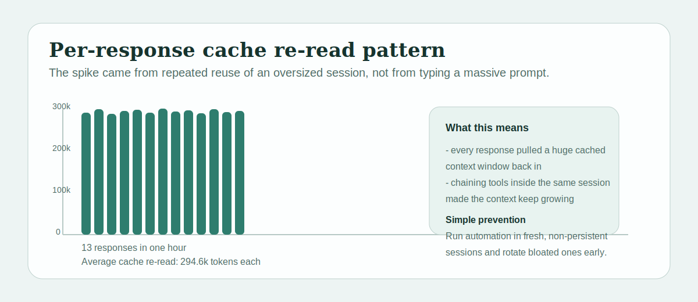

# save-my-claude-token

[한국어](./README.ko.md)

Claude Code Circuit Breaker for repeated `cache_read_input_tokens`.

## Quick Start

Hook only:

```bash
claude --plugin-dir /path/to/save-my-claude-token
```

Scanner:

```bash
save-my-claude-token scan
```

The hook is self-contained. It does not need the CLI binary on your `PATH`.

## What It Does

- blocks prompts when a Claude session looks bloated
- focuses on repeated `cache_read_input_tokens`
- includes an optional local scanner for Claude JSONL logs

## When It Trips

It trips when:

- recent `cache_read_input_tokens` is too high
- or the session event count is already too large

Tune the thresholds to your own tolerance.

## Incident

The problem that triggered this repo was not fresh prompt input. It was repeated `cache_read_input_tokens`.

On March 27, 2026, one Claude session made usage look like 12.18M tokens in a single hour.




Window totals:

- `cache_read_input_tokens`: `12,155,503`
- `cache_creation_input_tokens`: `21,517`
- `output_tokens`: `6,597`
- `input_tokens`: `50`
- assistant responses: `42`

## Plugin

This repository includes a Claude plugin with a self-contained `UserPromptSubmit` hook.

Local test:

```bash
claude --plugin-dir /path/to/save-my-claude-token
```

## Scanner

Optional CLI commands:

```bash
save-my-claude-token scan
save-my-claude-token scan --last 24h
save-my-claude-token scan --session 56a155b1-0617-4c90-831e-1d74c49b509e
save-my-claude-token scan --json
```

Developer install:

```bash
go install github.com/dalsoop/save-my-claude-token/cmd/save-my-claude-token@latest
```

No Go is required for hook-only use.

## Release Assets

```text
save-my-claude-token_linux_x86_64.tar.gz
save-my-claude-token_linux_aarch64.tar.gz
save-my-claude-token_darwin_x86_64.tar.gz
save-my-claude-token_darwin_aarch64.tar.gz
save-my-claude-token_windows_x86_64.zip
save-my-claude-token_windows_aarch64.zip
```

## Repo Metadata

Suggested GitHub repo description:

```text
Claude Code Circuit Breaker for repeated cache_read_input_tokens in bloated sessions.
```

Suggested release blurb:

```text
save-my-claude-token is a Claude Code Circuit Breaker. It trips when repeated cache_read_input_tokens make a session look bloated.
```

## License

MIT
